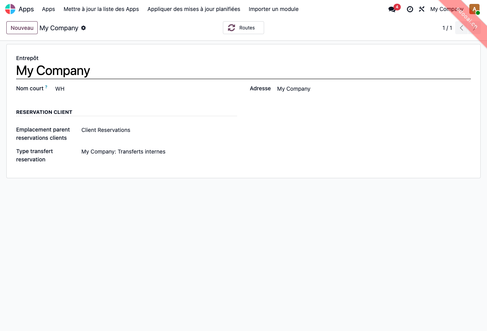
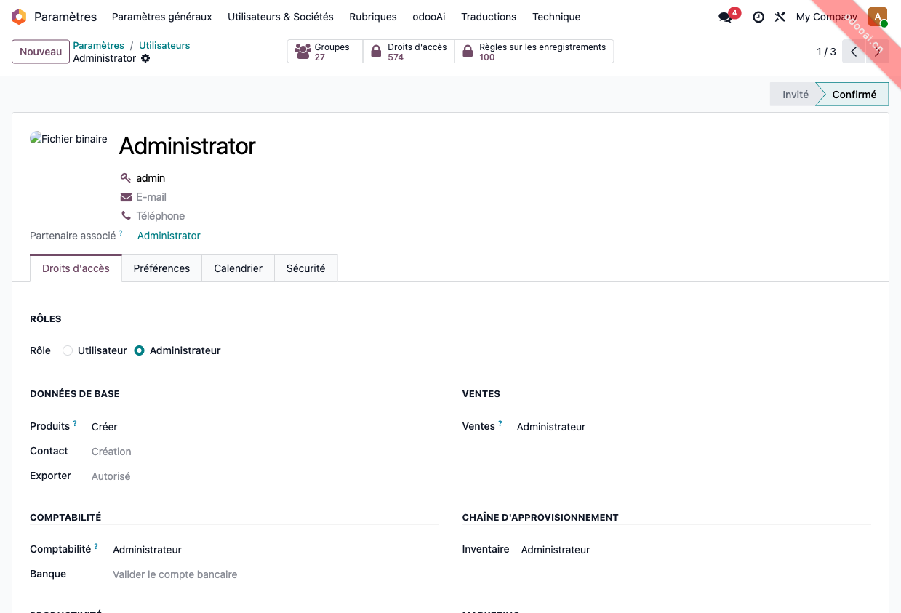
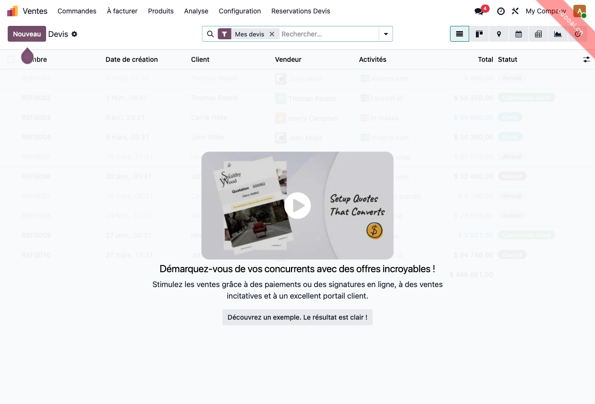
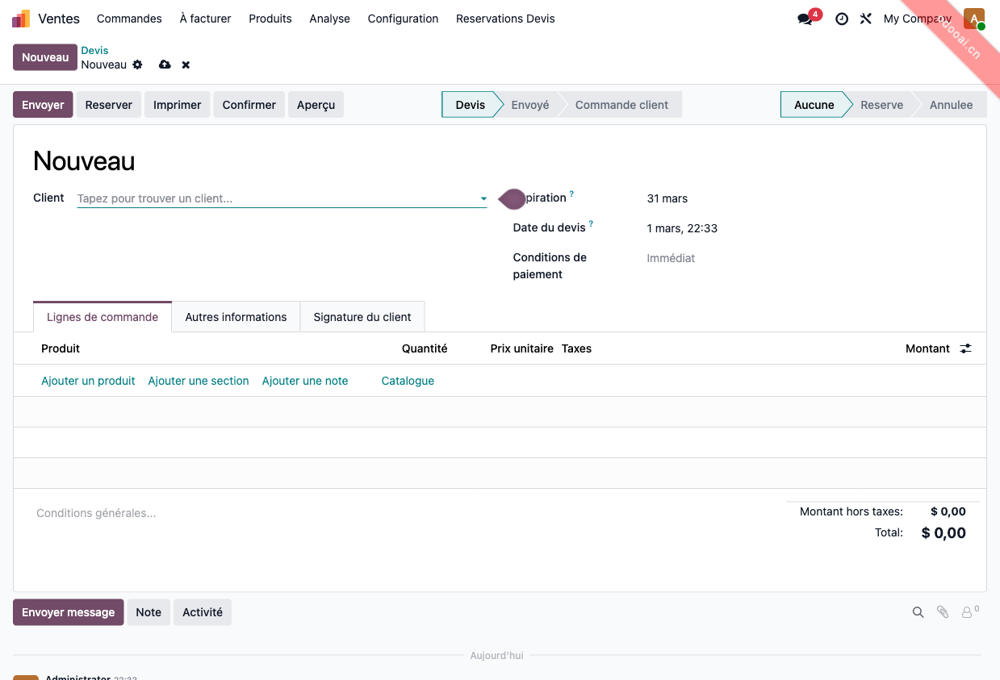
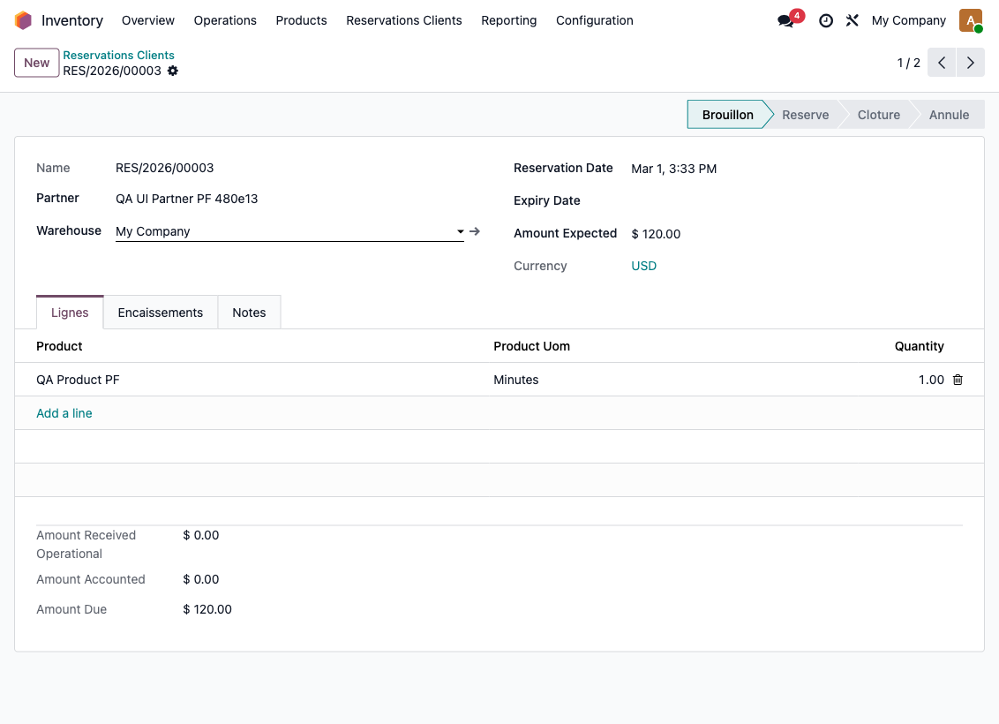
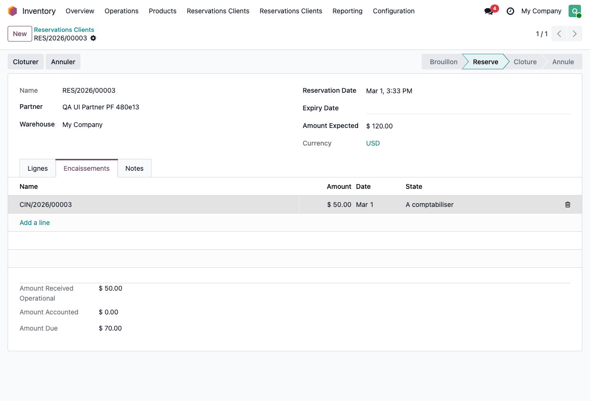
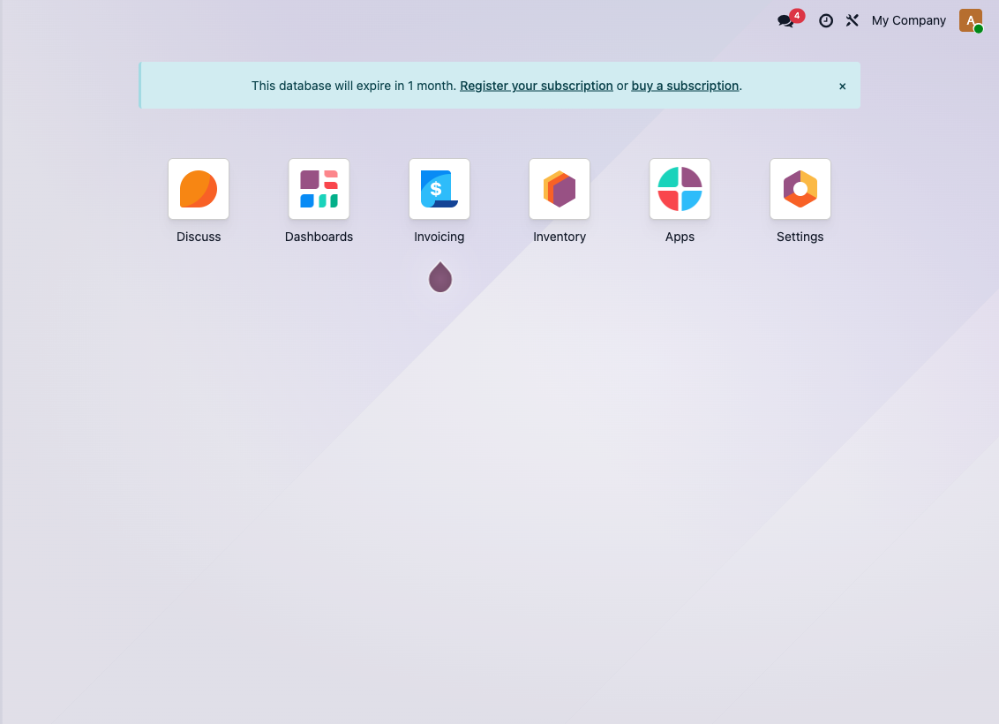
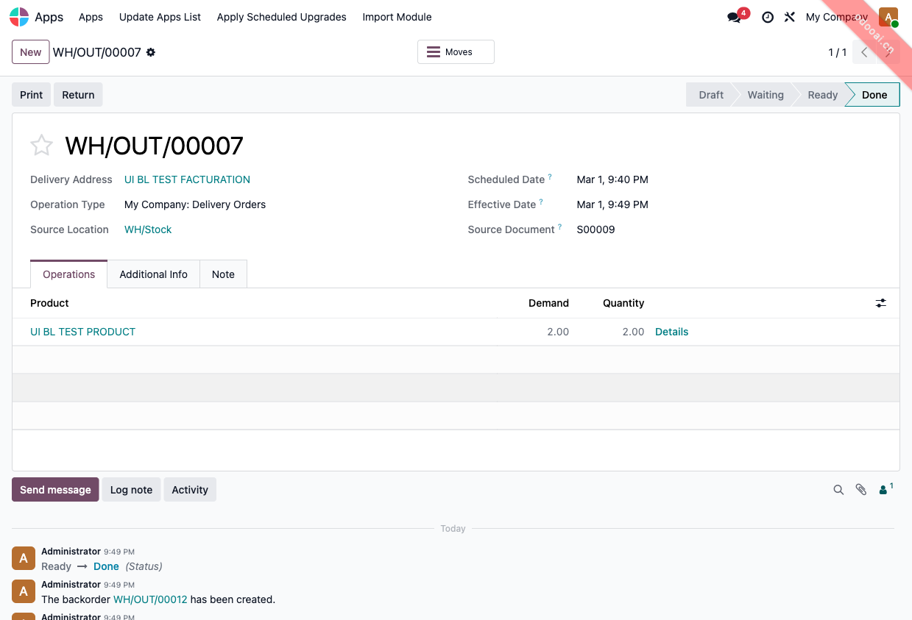

# Reservations Clients & Encaissements

Module Odoo 19 pour reserver le stock client depuis un devis, suivre les encaissements, et gerer la validation des livraisons avec option de facturation a un contact tiers.

## Compatibilite
- Odoo: `19.0`
- Editions: Community et Enterprise
- Module technique: `stock_customer_reservation_cash`

## Dependances
- `stock`
- `sale_management`
- `sale_stock`
- `account`
- `mail`

## Installation
1. Ajouter le module au `addons_path`.
2. Mettre a jour la liste des applications.
3. Installer **Reservations Clients & Encaissements**.

## 1) Configuration Warehouse
Chemin:
- `Inventaire > Configuration > Entrepots`

Champs utilises par le code:
- `Emplacement parent reservations clients`
- `Type transfert reservation`

Capture:

## 2) Utilisateurs et permissions
Chemin:
- `Parametres > Utilisateurs & Societes > Utilisateurs`

Groupes module:
- `Reservation Cash User`
- `Reservation Cash Manager`

Effets:
- User: lecture/ecriture/creation reservations + encaissements (sans suppression sur objets metier).
- Manager: droits complets + comptabilisation des encaissements + configuration.

Capture (fiche utilisateur, roles et droits):

## 3) Reservation depuis le devis (SO)
Chemin:
- `Ventes > Devis`

Etapes:
1. Ouvrir un devis en `Devis` ou `Envoye`.
2. Verifier la presence du bouton `Reserver`.
3. Cliquer `Reserver` pour creer la reservation et le transfert interne.

Captures:

## 4) Encaissement depuis le SO
Etapes:
1. Sur un devis reserve, cliquer `Encaisser`.
2. Renseigner le montant/mode de paiement.
3. Suivre le workflow `draft -> confirmed -> to_account -> accounted`.

Capture:

## 5) Validation BL avec facturation a autrui
Etapes:
1. Confirmer le devis en commande.
2. Ouvrir le BL genere.
3. A la validation, utiliser l'option `Facturer a autrui` et choisir le contact.
4. Valider le BL.

Resultat attendu:
- livraison validee,
- BC mis a jour au contact tiers,
- reliquat cree sur un nouveau BC avec le contact initial (si partiel).

Capture (etat final apres validation avec contact tiers):

## Securite et multi-societe
- ACL par groupes sur:
  - `sale.customer.reservation`
  - `reservation.cash.in`
  - `reservation.payment.mode`
  - `delivery.contact.wizard`
- Record rules `company_id in company_ids` sur reservations/modes de paiement/encaissements.
- Controle serveur sur la comptabilisation reservee au manager.

## Internationalisation
Fichiers inclus:
- `i18n/fr.po`
- `i18n/en.po`
- `i18n/fr_FR.po`
- `i18n/en_US.po`
